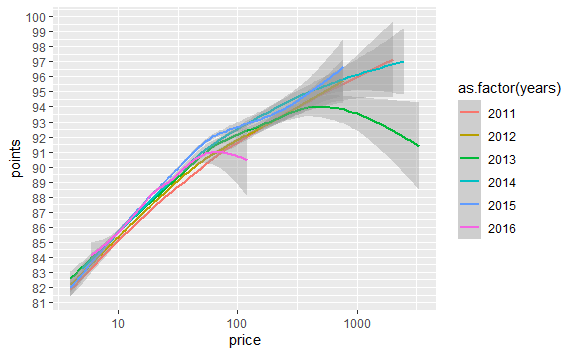
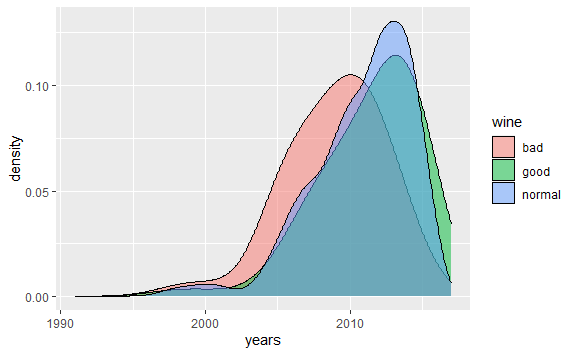
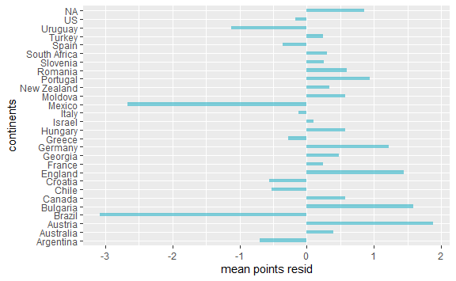
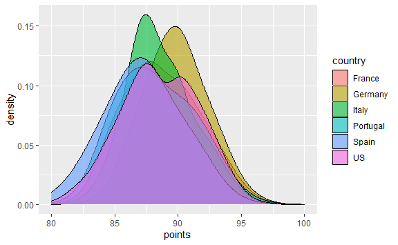
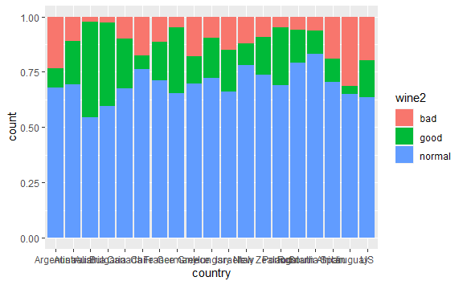
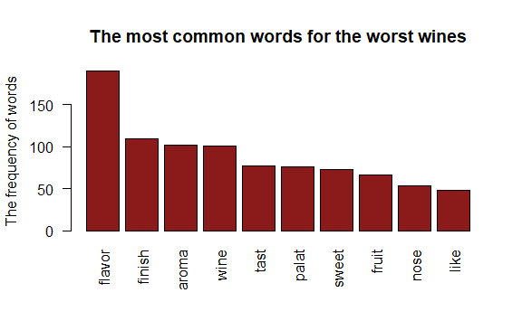
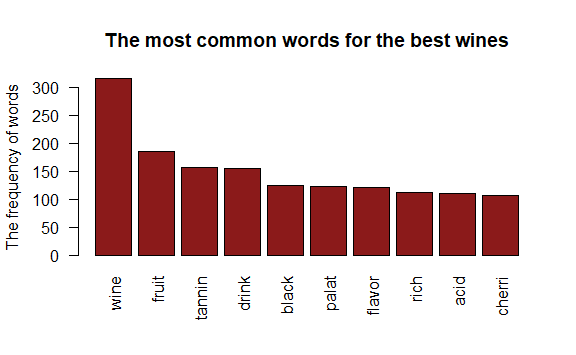
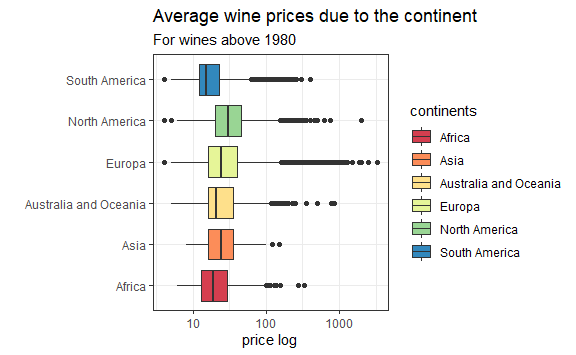

INTRODUCTION
============

Did you know that the oldest traces of wine date back 6000 years ago and
were discovered in Georgia? However, the ancient Greeks, and later the
Romans, improved viticulture and its production. In the Middle Ages,
however, its production was carried out by monks who made wines for
liturgical purposes and for their own consumption. And it is not about
the Benedictines drinking the proverbial lamp. Sources indicate that an
average of one liter of wine was drunk … per person! However, it was
only the 21st century that brought about radical changes on the map of
the world winemaking. At that time, countries such as Mexico,
Switzerland or the Czech Republic not enough that they produce on a
global scale, they do not differ in quality from French or Italian wines
in any way.

But where is the consumer in the brush of alcohol shops? Choosing the
right wine is not an easy thing to do, especially for someone who simply
does not know wines. Although, according to statistical surveys, in 2020
a Pole drank an average of 3.5 liters of wine and we are still far from
the leader in this classification, which is France (40 liters), this
market is growing dynamically, and the demand for good quality wines is
growing year by year.

Data from the site
[Kaggle](https://www.kaggle.com/zynicide/wine-reviews) include over 17
thousand unique wines that have been reviewed by world-class wine
experts such as Paul Gregutt, czy Virginie Boone. By analyzing this
data, I wanted to understand the needs of a potential client and try to
answer the most mediocre and at the same time the most frequent
questions; - *Does a good and highly valued wine have to be expensive?*
- *Which country does the best wines come from?* - *Which wines are both
cheap and highly valued, and which on the contrary?*

The answer to these and other questions is hidden in my analysis to I
invite you!

------------------------------------------------------------------------

Did the more expensive wines get higher points?
===============================================

I must admit that I expected such results. The linear relationship
between the points obtained and the price is very clear here. However,
some wines from 2013, despite their high price, were rated lower than
the rest.

| country |  points|  price| region      | variety                  |
|:--------|-------:|------:|:------------|:-------------------------|
| France  |      88|   3300| Médoc       | Bordeaux-style Red Blend |
| US      |      91|   2013| Arroyo Seco | Chardonnay               |

As you can see, there are only two wines. However, when buying a wine
for $ 2,000 or $ 3,000, I would like it to be as good as possible and
receive the maximum number of points from the reviewer. Especially that
for one wine in the ‘good’ category, I have as many as 75 bottles of
outstanding wine.

------------------------------------------------------------------------

Perfect wines!
==============

This is probably one of the most important pieces of information that I
have found while analyzing this data. WI did a linear regression to
accurately determine the rest of the model. In the case of negative
residuals, we will deal with wines with a high price and low points,
while wines with a low price and high points will have positive
residuals.

| country  |  points|  price| region                  | variety                  |  points\_resid|
|:---------|-------:|------:|:------------------------|:-------------------------|--------------:|
| US       |      99|     44| Sonoma Coast            | Chardonnay               |       9.240777|
| US       |     100|     80| Columbia Valley (WA)    | Syrah                    |       8.538069|
| US       |     100|     80| Walla Walla Valley (WA) | Syrah                    |       8.538069|
| US       |      96|     20| Columbia Valley (WA)    | Syrah                    |       8.486393|
| US       |      97|     35| El Dorado               | Syrah                    |       7.892544|
| US       |      98|     50| Columbia Valley (WA)    | Bordeaux-style Red Blend |       7.876693|
| US       |      99|     75| Walla Walla Valley (OR) | Syrah                    |       7.721882|
| US       |      99|     75| Sonoma Coast            | Pinot Noir               |       7.721882|
| US       |      99|     75| Walla Walla Valley (OR) | Syrah                    |       7.721882|
| Portugal |      94|     13| NA                      | Portuguese Red           |       7.713312|
| Italy    |      96|     27| Chianti Classico        | Red Blend                |       7.631661|
| US       |      96|     27| El Dorado               | Grenache                 |       7.631661|
| US       |      96|     27| Dundee Hills            | Chardonnay               |       7.631661|

As we can see, in this case we have the wines that consumers are most
interested in. Because when buying wine, who has never asked themselves
the question ‘What kind of wine should you choose to make it good, but
the price is decent?’ let the first one throw a stone! As you can see in
the first place we have a wine that costs $ 44 and received as much as
99 points out of 100 from the reviewer! As you can see, a low price can
often go hand in hand with the quality and taste of wine.

------------------------------------------------------------------------

Wines we should avoid!
======================

| country  |  points|  price| region             | variety                  |  points\_resid|
|:---------|-------:|------:|:-------------------|:-------------------------|--------------:|
| France   |      88|   3300| Médoc              | Bordeaux-style Red Blend |      -14.05592|
| Spain    |      81|    130| Montsant           | Red Blend                |      -11.84471|
| Spain    |      83|    225| Rioja              | Tempranillo Blend        |      -11.40709|
| US       |      82|    150| Paso Robles        | Bordeaux-style Red Blend |      -11.25228|
| US       |      80|     69| Napa Valley        | Zinfandel                |      -11.04064|
| France   |      87|    800| Menetou-Salon      | Rosé                     |      -11.01996|
| Portugal |      87|    790| NA                 | Port                     |      -10.98413|
| US       |      81|     95| Saddle Rock-Malibu | Bordeaux-style Red Blend |      -10.95138|
| Chile    |      81|     90| NA                 | Bordeaux-style Red Blend |      -10.79739|
| US       |      81|     85| Knights Valley     | Cabernet Sauvignon       |      -10.63460|

We try to avoid these wines, because they are not very well rated by
reviewers, but their price, often very high, discourages potential
customers from buying them. Taking into account the awarded points and
their price, I would definitely not risk buying such a wine and I am
glad that someone did it for me.

------------------------------------------------------------------------

Have the older wines scored better?
===================================

In my analysis, I wanted to focus mainly on the biggest stereotypes and
check their reality in the real world. As it turns out, the age of the
wine does not always affect its quality. In the chart, we can see
visible differences between the groups of wines. Perhaps the myth that
better wine = older wine has just been refuted? It is so often that time
is not good for wines at all. An example is the French Beaujolais
nouveau, a red wine made from gamay grape varieties. The production
process allows the fermentation to be completed quickly and the wine is
sold as soon as it is finished, however, as a consequence, the life of
such wine is limited only to about a year.

------------------------------------------------------------------------

Where are you from?
===================

Another question that bothers everyone; ‘Which country do you choose a
good wine from?’ Since we do not know each other about the strains, we
do not know anything about the yearbook, maybe the knowledge of the
country of origin will help us with this?

And we have the answer! If we want a good wine, we will DEFINITELY
choose Mexico or Brazil, unless we do not care;) Interestingly, wines
from Austria and Germany are the best, while such old-timers as Italy
and France ranked low in the ranking. It seems that for wine
connoisseurs, the podium should not be surprising. Both Austria and
Germany are leaders in the production of riesling, world-famous white
wines. Interestingly, this grape can be used to produce both slovak and
dry wines, so something for everyone.

------------------------------------------------------------------------

Tweeter, tell me which wine is the best in the world!
=====================================================

Having wine reviews in the form of tweets in the database, I couldn’t
help but take advantage of it. I split my dataset into low-scoring wines
and those with the most points, and then ran a sentiment analysis. For
these two groups, I checked which expressions correlate with the word
‘flavor’. I was very curious if the differences in the choice of words
by the reviewers would be so visible that it would allow us to draw
certain conclusions based on them.

    ## $aroma
    ## tobacco   palat     â\200“ licoric  cherri  finish   berri leather   drink   spice 
    ##    0.41    0.41    0.37    0.35    0.34    0.32    0.32    0.32    0.31    0.31

    ## $aroma
    ## flavor finish  palat  fruit  candi bitter   feel  color   plum 
    ##   0.48   0.43   0.32   0.26   0.24   0.23   0.23   0.22   0.21

BINGO! It turns out that the differences do exist and are very clear.
While the former, which received high marks, are usually characterized
by a stronger and more complex aroma, the latter, with lower scores, are
characterized by a sweet and fruity aroma.

Below we can see which words were the most popular among the reviewers
when writing reviews about individual wines.

------------------------------------------------------------------------

Which continent are the most expensive wines?
=============================================

As I mentioned at the beginning, the 21st century brought about a
significant change in winemaking. A technological revolution in wine
production - incl. the use of stainless steel tanks, automatic
temperature control during wine fermentation and maturation, the use of
new barrels, etc. - made it possible to produce good quality wine in
warm countries and regions - in California, Australia, South Africa.
Wines from the USA, Chile, Argentina, New Zealand, Australia, South
Africa - from countries known as the New Wine World are appreciated
among consumers all over the world.

The fact that nowadays it is possible to grow grapevines in virtually
every country, I wanted to check the price of wine depending on the
continent it comes from.

As you can see, the price differences are not very noticeable at first
glance. However, on closer inspection, we can come to the conclusion
that the most expensive wines come from North America, and the cheapest
from South America.

------------------------------------------------------------------------

SUMMARY
=======

Viticulture and wine production are important branches of the economy in
many countries. Hundreds of thousands of people work in thousands of
wine companies, contributing to an increase in the national income. The
wine trade is global. Price differences make wine affordable for the
mass consumer. Special wines are also the subject of investment.
